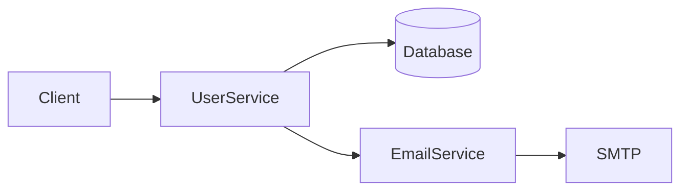

# AIS Code - Spec-Driven Development Module

## Overview

The Spec-Driven Development module is a core feature that differentiates AIS Code from other AI coding assistants. It enforces a structured approach to software development, ensuring that code is always backed by specifications.

---

## Three-Tier Specification Model

```
┌─────────────────────────────────────────────────────────────────┐
│                    ARCHITECTURE SPEC                             │
│  High-level system design, components, relationships             │
│  Answer: "What are we building and how does it fit together?"   │
└───────────────────────────────────┬─────────────────────────────┘
                                    │ Links to
                                    ▼
┌─────────────────────────────────────────────────────────────────┐
│                    DETAILED SPEC                                 │
│  API contracts, data models, edge cases, error handling          │
│  Answer: "How exactly does each component work?"                │
└───────────────────────────────────┬─────────────────────────────┘
                                    │ Links to
                                    ▼
┌─────────────────────────────────────────────────────────────────┐
│                    EXECUTION PLAN                                │
│  Task breakdown, dependencies, acceptance criteria               │
│  Answer: "What do we implement and in what order?"              │
└─────────────────────────────────────────────────────────────────┘
```

---

## Specification Format

### Architecture Spec (`architecture.md`)

````markdown
---
type: architecture
version: 1
created: 2024-01-15
updated: 2024-01-20
status: approved
---

# System Architecture: [Feature Name]

## Context

[Business context and requirements]

## System Components

### Component: UserService

- **Purpose**: Manages user authentication and profiles
- **Inputs**: Login credentials, profile updates
- **Outputs**: JWT tokens, user data
- **Dependencies**: Database, EmailService
- **Detailed Spec**: [[detailed/user-service.md]]

### Component: EmailService

- **Purpose**: Sends transactional emails
- **Inputs**: Email templates, recipient data
- **Outputs**: Delivery status
- **Dependencies**: SMTP provider
- **Detailed Spec**: [[detailed/email-service.md]]

## Component Diagram


````

## Non-Functional Requirements

- Response time: < 200ms
- Availability: 99.9%
- Data retention: 90 days

````

---

### Detailed Spec (`detailed/user-service.md`)

```markdown
---
type: detailed
version: 1
parent: [[architecture.md#UserService]]
status: in-progress
---

# UserService - Detailed Specification

## API Contracts

### POST /api/users/login
**Request:**
```json
{
  "email": "string",
  "password": "string"
}
````

**Response 200:**

```json
{
  "token": "string (JWT)",
  "expiresAt": "ISO8601",
  "user": {
    "id": "string",
    "email": "string",
    "name": "string"
  }
}
```

**Response 401:**

```json
{
  "error": "Invalid credentials"
}
```

## Data Models

### User

| Field        | Type     | Constraints      |
| ------------ | -------- | ---------------- |
| id           | UUID     | primary key      |
| email        | string   | unique, required |
| passwordHash | string   | required         |
| name         | string   | required         |
| createdAt    | DateTime | auto             |
| updatedAt    | DateTime | auto             |

## Edge Cases

1. **Email not found** → Return 401 (don't reveal if email exists)
2. **Account locked** → Return 403 with lockout duration
3. **Concurrent logins** → Allow up to 5 sessions

## Execution Tasks

- [[execution/task-001.md]]: Create User model
- [[execution/task-002.md]]: Implement login endpoint
- [[execution/task-003.md]]: Add rate limiting

````

---

### Execution Plan (`execution/plan.md`)

```markdown
---
type: execution-plan
version: 1
parent: [[architecture.md]]
status: in-progress
progress: 40%
---

# Execution Plan: User Authentication

## Task Overview

| ID | Task | Status | Depends On | Estimated |
|----|------|--------|------------|-----------|
| 001 | Create User model | ✅ Done | - | 1h |
| 002 | Implement login endpoint | 🔄 In Progress | 001 | 2h |
| 003 | Add rate limiting | ⬜ Pending | 002 | 1h |
| 004 | Write integration tests | ⬜ Pending | 002, 003 | 2h |
| 005 | Add password reset flow | ⬜ Pending | 001 | 3h |

## Task Details

### Task 001: Create User model
**File**: `src/models/User.ts`
**Detailed Spec**: [[detailed/user-service.md#Data Models]]
**Acceptance Criteria**:
- [ ] Model matches schema in spec
- [ ] Migrations are generated
- [ ] TypeScript types are correct

### Task 002: Implement login endpoint
**File**: `src/routes/auth.ts`
**Detailed Spec**: [[detailed/user-service.md#POST /api/users/login]]
**Acceptance Criteria**:
- [ ] Endpoint returns JWT on success
- [ ] Password is verified securely
- [ ] Error responses match spec
````

---

## Linking System

All specs are interconnected using a wiki-style linking syntax:

```
[[path/to/spec.md]]           → Full document link
[[path/to/spec.md#Section]]   → Section anchor link
[[spec.md|Custom Label]]      → Link with custom text
```

### Link Resolution

```typescript
interface SpecLink {
  type: "document" | "section" | "task";
  path: string;
  anchor?: string;
  label?: string;
}

function resolveLink(link: string, currentFile: string): SpecLink {
  // Parse [[target#anchor|label]] syntax
  // Resolve relative to current file location
  // Return structured link object
}
```

---

## Workflow

### 1. Spec Generation

```
User Request: "Build user authentication with login and password reset"
                                    │
                                    ▼
┌─────────────────────────────────────────────────────────────┐
│                    Architect Agent                           │
│                                                              │
│  1. Analyze request                                          │
│  2. Generate architecture.md                                 │
│  3. Break down into components                               │
│  4. Create detailed specs for each component                 │
│  5. Generate execution plan with tasks                       │
│  6. Link everything together                                 │
│                                                              │
└─────────────────────────────────────────────────────────────┘
                                    │
                                    ▼
           User Review & Approval (or Request Changes)
```

### 2. Spec Navigation UI

The WebView displays specs with:

- Clickable links between specs
- Progress indicators per section
- Collapsible sections
- Inline editing
- Version history

### 3. Task Execution

```
┌──────────────┐     ┌──────────────┐     ┌──────────────┐
│   Pick Task  │────▶│   Coder      │────▶│   Reviewer   │
│   from Plan  │     │   Agent      │     │   Agent      │
└──────────────┘     └──────────────┘     └──────────────┘
                            │                    │
                            ▼                    │
                     ┌──────────────┐            │
                     │   Generate   │            │
                     │   Code       │            │
                     └──────────────┘            │
                            │                    │
                            ▼                    ▼
                     ┌──────────────┐     ┌──────────────┐
                     │   Update     │◀────│   Review     │
                     │   Task Status│     │   Feedback   │
                     └──────────────┘     └──────────────┘
```

---

## File Structure in Workspace

When a user initiates spec-driven development, the following structure is created:

```
project/
├── .ais/
│   └── specs/
│       ├── architecture.md
│       ├── detailed/
│       │   ├── component-a.md
│       │   └── component-b.md
│       └── execution/
│           ├── plan.md
│           └── tasks/
│               ├── task-001.md
│               ├── task-002.md
│               └── task-003.md
└── src/
    └── ... (actual code)
```

---

## Benefits

1. **Traceability** - Every line of code links back to a requirement
2. **Documentation** - Specs serve as living documentation
3. **Onboarding** - New developers understand the system quickly
4. **AI Context** - Agents have structured context for better code
5. **Refactoring** - Specs help identify impact of changes
